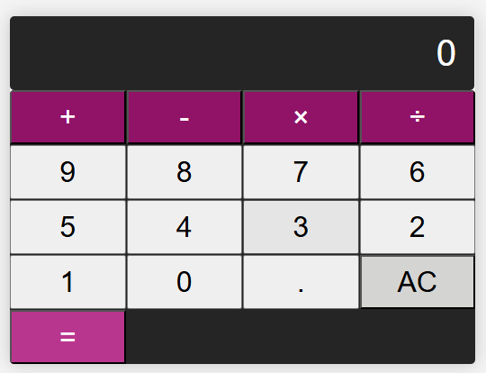

# Calculateur Simple

Ce projet consiste en un calculateur simple qui effectue des opérations de base (addition, soustraction, multiplication, division) à l'aide de HTML, CSS et JavaScript. L'interface utilisateur est construite en HTML et stylée avec du CSS. La logique des calculs est gérée par un script JavaScript.

## Structure du projet

Le projet est composé des fichiers suivants :

- `index.html` : Le fichier HTML qui contient la structure de l'interface du calculateur.
- `styles.css` : Le fichier CSS qui contient les styles pour le calculateur (mise en page, couleurs, tailles, etc.).
- `script.js` : Le fichier JavaScript qui gère la logique des opérations mathématiques et l'interactivité de l'interface.

## Aperçu du projet

Voici à quoi ressemble l'interface du calculateur :



## Fonctionnalités

- Addition, soustraction, multiplication et division.
- Affichage des résultats en temps réel.
- Interface utilisateur simple et intuitive.

## Installation

### Prérequis

Aucun logiciel spécifique n'est nécessaire pour exécuter ce projet. Vous avez seulement besoin d'un navigateur web pour ouvrir le fichier HTML.

### Pour démarrer

1. Clonez ce repository :

   ```bash
   git clone https://github.com/josephDelnord/calculator.git
